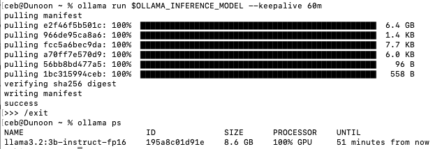
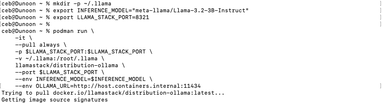
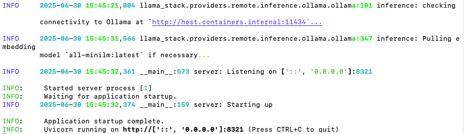
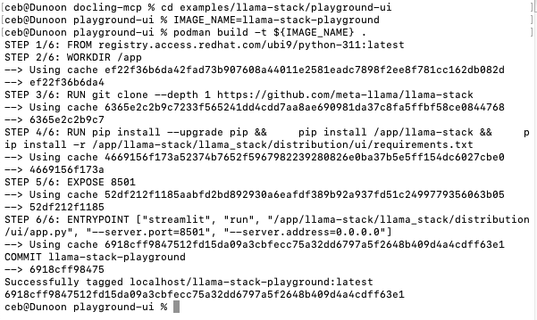
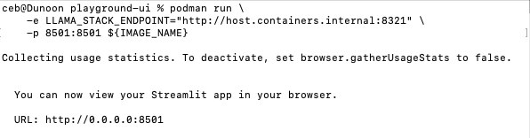
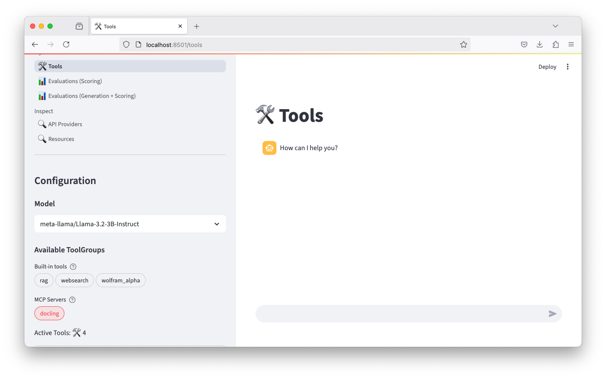
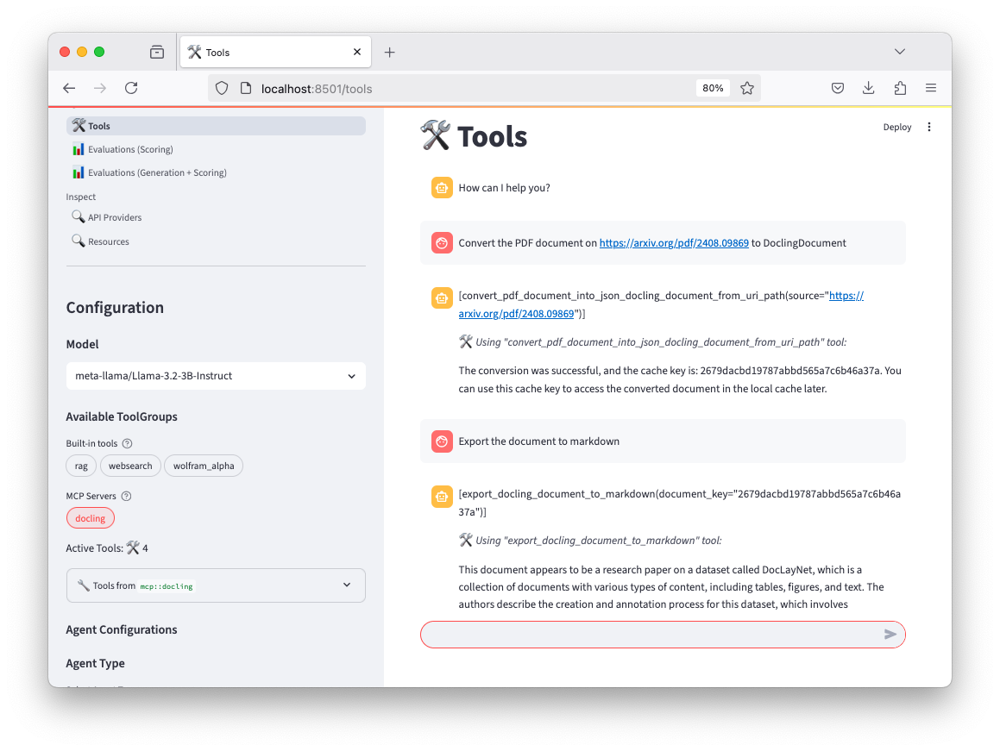
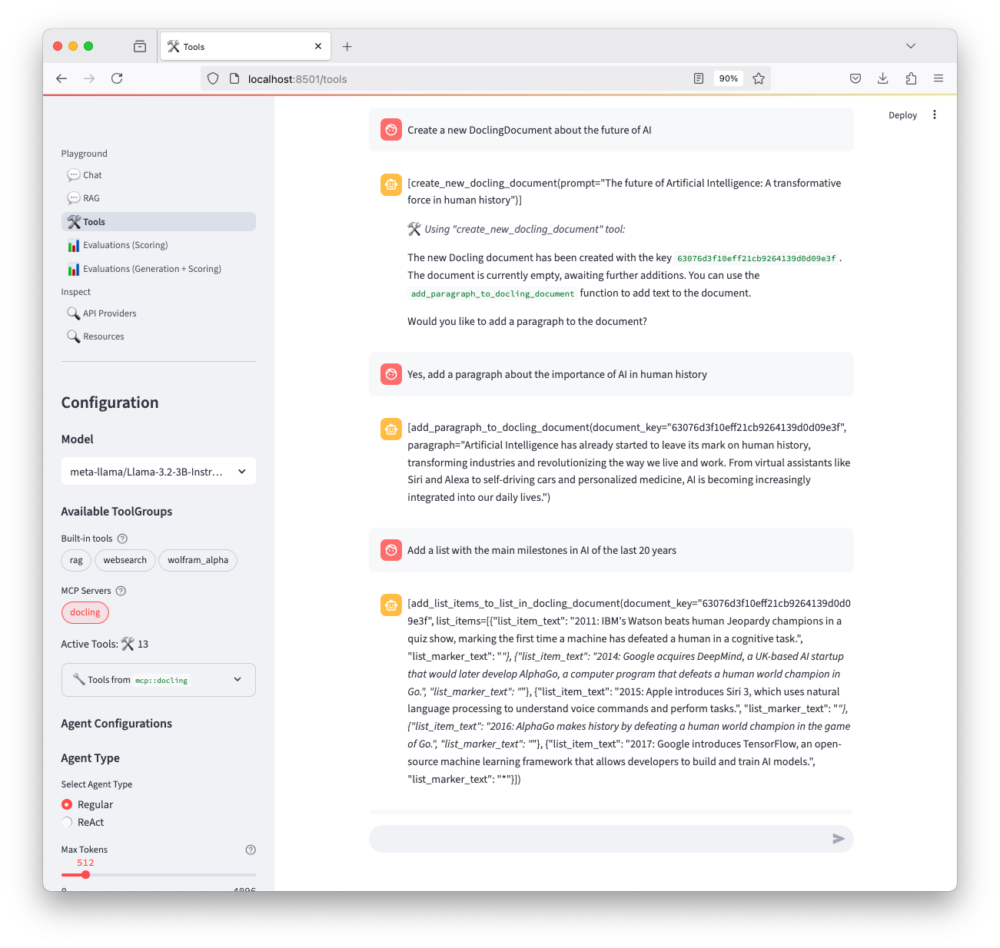
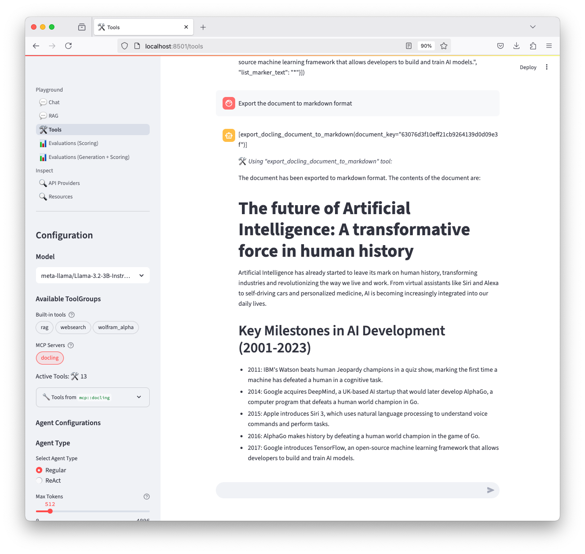

# LLama Stack examples for creating agents using Docling MCP tools

[Llama Stack](https://github.com/meta-llama/llama-stack) is a framework with a unified API layer for agents that supports a rich ecosystem of tools for building AI applications. Together with its [playground UI](https://llama-stack.readthedocs.io/en/latest/playground/), Llama Stack provides the MCP host and client components to interact with the Docling MCP server and LLMs such as Meta Llama or IBM Granite.

In this documentation, we show how to run all those components and test the Docling MCP tools in your local machine.

## Requirements

The following applications are required in this example. Refer to their documentation:

- [uv](https://github.com/astral-sh/uv)
- [Ollama](https://github.com/ollama/ollama)
- [Podman](https://podman.io/docs/installation)

## Setup


### Run Llama Stack

As a simple starting point, we will use the [Ollama distribution](https://llama-stack.readthedocs.io/en/latest/distributions/self_hosted_distro/ollama.html) which allows Llama Stack to easily run locally.
Other distributions (or custom stack builds) will work very similarly. See a complete list in the [Llama Stack docs](https://llama-stack.readthedocs.io/en/latest/distributions/list_of_distributions.html).

We will use [Meta Llama 3.2](https://huggingface.co/meta-llama/Llama-3.2-3B-Instruct) as generative AI model. Other options supported by the stack are [IBM Granite 3.2](https://huggingface.co/ibm-granite/granite-3.2-8b-instruct) and [Qwen3](Qwen/Qwen3-32B).


<table style="width: 100%;">
<tr>
<td style="width: 60%;">
<b>Step 1</b>
<br/><br/>
Pull and load the inference model with Ollama.
<br/><br/>

> [!IMPORTANT]
> We must use the Ollama name when loading the model, which may differ from the name in HuggingFace.

  ```shell
  export OLLAMA_INFERENCE_MODEL="llama3.2:3b-instruct-fp16"
  
  ollama run $OLLAMA_INFERENCE_MODEL --keepalive 60m
  ```

You can type `/exit` to exit the interactive shell and check that the model is running with the command `ollama ps`.

</td>
<td style="width: 40%;"></td>
</tr>
<tr>
<td style="width: 60%;">
<b>Step 2</b>
<br/><br/>
Before running the Llama Stack server, you will need to create a local directory to mount into the container’s file:
  
  ```shell
  mkdir -p ~/.llama
  ```

Then start the server using a container tool like Podman or Docker.

  ```shell
  export INFERENCE_MODEL="meta-llama/Llama-3.2-3B-Instruct"
  export LLAMA_STACK_PORT=8321
  
  podman run \
    -it \
    --pull always \
    -p $LLAMA_STACK_PORT:$LLAMA_STACK_PORT \
    -v ~/.llama:/root/.llama \
    llamastack/distribution-ollama \
    --port $LLAMA_STACK_PORT \
    --env INFERENCE_MODEL=$INFERENCE_MODEL \
    --env OLLAMA_URL=http://host.containers.internal:11434
  ```
</td>
<td style="width: 40%;">


</td>
</tr>
</table>


### Connect to Docling MCP server

We will run Docling MCP server locally, which exposes many functionalities from Docling through the MCP protocol.
Then we will register the MCP server as a tool group in the Llama Stack server.

1. Clone this repository [docling-mcp](https://github.com/docling-project/docling-mcp)

   ```shell
   git clone git@github.com:docling-project/docling-mcp.git
   cd docling-mcp
   ```

2. Create a new virtual environment and sync the project's dependencies with the environment

   ```shell
   uv sync
   ```

3. Run the Docling MCP server with the SSE transport option `sse` (default)

   ```shell
   uv run docling-mcp-server --transport sse --http-port 8000
   ```

4. In another terminal, register the Docling tools

   You can use the Tool Group Management of the [llama (client-side) CLI](https://llama-stack.readthedocs.io/en/latest/references/llama_stack_client_cli_reference.html#)
   to register the Docling MCP server tools:

   ```shell
   uvx --from llama-stack-client llama-stack-client toolgroups register "mcp::docling" \
     --provider-id="model-context-protocol" \
     --mcp-endpoint="http://host.containers.internal:8000/sse"
   ```

5. Inspect the tools

   ```shell
   uvx --with llama-stack --from llama-stack-client llama-stack-client toolgroups list
   ```

   Make sure that the Docling MCP endpoint appears on the output list:

   ```console
   ┏━━━━━━━━━━━━━━━━━━━━━━━━┳━━━━━━━━━━━━━━━━━━━━━━━━┳━━━━━━┳━━━━━━━━━━━━━━━━━━━━━━━━━━━━━━━━━━━━━━━━━━━━━━━━━━━━━━━━━━━━━┓
   ┃ identifier             ┃ provider_id            ┃ args ┃ mcp_endpoint                                                ┃
   ┡━━━━━━━━━━━━━━━━━━━━━━━━╇━━━━━━━━━━━━━━━━━━━━━━━━╇━━━━━━╇━━━━━━━━━━━━━━━━━━━━━━━━━━━━━━━━━━━━━━━━━━━━━━━━━━━━━━━━━━━━━┩
   │ builtin::rag           │ rag-runtime            │ None │ None                                                        │
   │ builtin::websearch     │ tavily-search          │ None │ None                                                        │
   │ builtin::wolfram_alpha │ wolfram-alpha          │ None │ None                                                        │
   │ mcp::docling           │ model-context-protocol │ None │ McpEndpoint(uri='http://host.containers.internal:8000/see') │
   └────────────────────────┴────────────────────────┴──────┴─────────────────────────────────────────────────────────────┘
   ```

## Use the Llama Stack agents

### Playground UI

Llama Stack provides a demonstration playground UI ([Llama Stack Playground](https://llama-stack.readthedocs.io/en/latest/playground/)). At the moment the UI is not distributed and has to be built from sources.

The example [playground-ui](./playground-ui/) provides the simple instructions to get it working locally.


<table style="width: 100%;">
<tr>
<td style="width: 50%;">
<b>Step 1</b>
<br/><br/>

Build an image from the latest [Llama Stack Playground](https://llama-stack.readthedocs.io/en/latest/playground/).
<br/><br/>

  From the root of your `docling-mcp` local repository, type:

  ```shell
  cd examples/llama-stack/playground-ui
  IMAGE_NAME=llama-stack-playground

  podman build -t ${IMAGE_NAME}  .
  ```

</td>
<td style="width: 50%;"></td>
</tr>
<tr>
<td style="width: 50%;">
<b>Step 2</b>
<br/><br/>

  Run the image:  

  ```shell
  podman run \
    -e LLAMA_STACK_ENDPOINT="http://host.containers.internal:8321" \
    -p 8501:8501 ${IMAGE_NAME}
  ```

</td>
<td style="width: 50%;"></td>
</tr>
<tr>
<td style="width: 50%;">
<b>Step 3</b>
<br/><br/>

  Access the UI on http://localhost:8501/tools in your browser.

  - Verify that the LLM model (`granite3.2:latest`) is select on the **Model** section.
  - Check that the **docling** MCP server shows up on the **Available ToolGroups** section.
  - Click on the **docling** button and check the list of available tools.
    The buton needs to stay _pressed_ (with a red background) to interact with Docling MCP tools.
</td>
<td style="width: 50%;"></td>
</tr>
</table>


### Try out some use case scenarios

#### Conversion

You can instruct the agent to fetch a PDF document, convert it, and give a summary of its content:



#### Generation

Instruct the agent to generate a `DoclingDocument` from a given topic and add structured content interactively.

<table style="width: 100%;">
<tr>
<td style="width: 50%;"></td>
<td style="width: 50%;"></td>
</tr>
</table>


### Test the agent programmatically 🚧

The same results are achieved when calling the Llama Stack agents runtime from a script.
